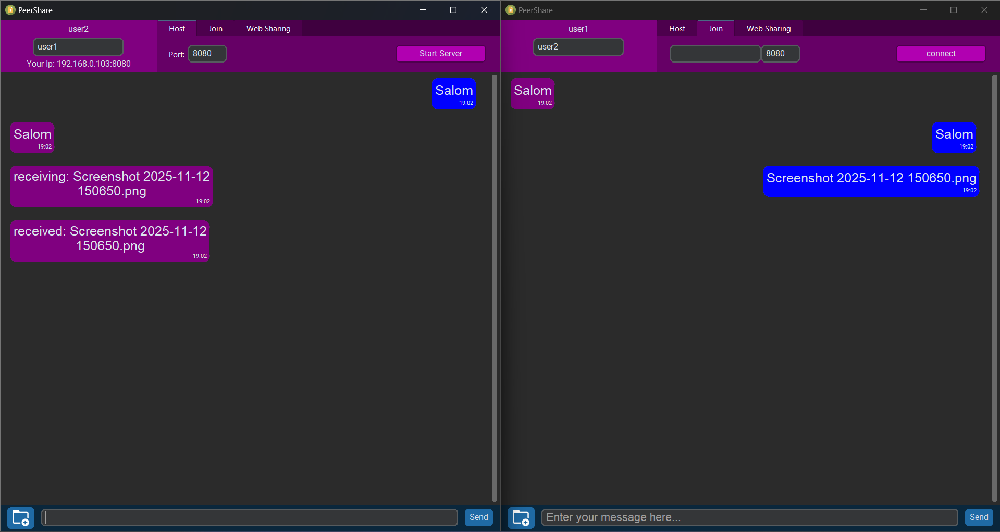

# PeerShare
Lokal tarmoqda barcha turdagi fayllar va matn ko'rinishidagi xabarlar ulashish uchun dastur.

## Mundarija
- [Qo'llanma](#Qo'llanma)
- [Litsenziyalar](#Litsenziyalar)
- [Loyiha jamoasi](#Loyiha-jamoasi)

## Qo'llanma

Ushbu programma Windows operatsion tizimida ishlatish uchun mo'ljallangan.
Shunchaki main.exe faylini oching. Agar boshqa operatsion tizim bo'lsa main.py dasturini Python3 orqali ishga tushiring. std-lib dan tashqari kerak bo'ladigan kutubxonalar: Future (tkinter), customtkinter.

pyinstaller kutubxonasida windows uchun build yaratish uchun ishlatilgan buyruq:
```commandline
pyinstaller --noconfirm --onefile --windowed --icon "D:\code\Python\fileshare3\icon.ico" --add-data "D:\code\Python\fileshare3\checkport.py;." --add-data "D:\code\Python\fileshare3\choosefile.png;." --add-data "D:\code\Python\fileshare3\client.py;." --add-data "D:\code\Python\fileshare3\httpserver.py;." --add-data "D:\code\Python\fileshare3\icon.ico;." --add-data "D:\code\Python\fileshare3\ipconfig.py;." --add-data "D:\code\Python\fileshare3\server.py;." --hidden-import "customtkinter"  "D:\code\Python\fileshare3\main.py"
```

### Ilovadagi imkoniyatlar:

#### Ikki windows-os qurilma orasida ulanishda fayl va xabar ulashish

Buning uchun ikkita qurilmada dasturni ishga tushiring va ismingizni yozib oling (yozilmagan holda avtomatik **user** deb qabul qiladi).

Bittasida Server bo'limidan port yozib (yozmasanggiz **8080** deb oladi) serverni ishga tushiring. Muvaffaqiyatli bajarilsa ismingiz kiritilgan joyning tagida sizning Lokal tarmoqdagi IP manzilingiz chiqadi agar lokal tarmoqqa ulanmagan bo'lsangiz 127.0.0.1 chiqadi. 127.0.0.1 IP manzil chiqqanda siz faqat bir qurilmada ikkinchi dastur oynasidan ulanishingiz mumkin.


Ikkinchi qurilmadan esa **Join** bo'limiga o'tib serverning IP manzil va portini kiriting (kiritmasanggiz **127.0.0.1** va **8080** deb oladi). Muvaffaqiyatli bajarilsa ismingiz kiritilgan joyning tepasida boshqa qurilmaning ismi chiqadi.

Ulangandan so'ng ikkala qurilma fayl almashishi yoki xabarlashishi mumkin.



#### WEB orqali barcha turdagi OS larga fayl uzatish

Qabul qiluvchi qurilmaga oldindan dasturni o'rnatish kerak emas.

⚠️**Diqqat!**
<br>
Bu uslub bilan fayl ulashganingizda siz biron katalogning (papkaning) ichidagi barcha fayllar bilan ulashasiz. Agar maxfiy ma'lumotlaringiz bo'lsa kerakli fayllarni alohida katalogga joylab qo'ying.

**WEB-Sharing** bo'limidan port kiriting (agar kiritmasangiz 8080 deb oladi) va **Choose Directory** tugmasidan katalogni tanlab oling. So'ngra **Start web sharing** tugmasini bosganingizdan keyin **Web server started! Your IP address: [...]** degan xabar chiqadi:
<br>

<br>
Ilova ko'rsatgan ip address va port orqali ushbu lokal tarmoqdagi barcha qurilmalar brauzer orqali belgilangan katalogga kirib ixtiyoriy faylni yuklab olish imkoniyatini qo'lga kiritishadi.  

## Litsenziyalar
Ushbu dastur MIT litsenziyasi asosida github platformasiga joylangan.
<br>
Barcha foydalanilgan rasmlar [iconarchive.com](https://www.iconarchive.com/) saytidan olingan.

## Loyiha-jamoasi

"TIIAME" - Milliy tadqiqot universiteti, Ekologiya va huquq fakulteti, 2-kurs DI yo'nalishi talabalari:
<br>
Nasrullayev Ismatullo
<br>
Turdaliyev Sherzod
<br>
2025-2026 - o'quv yili.
